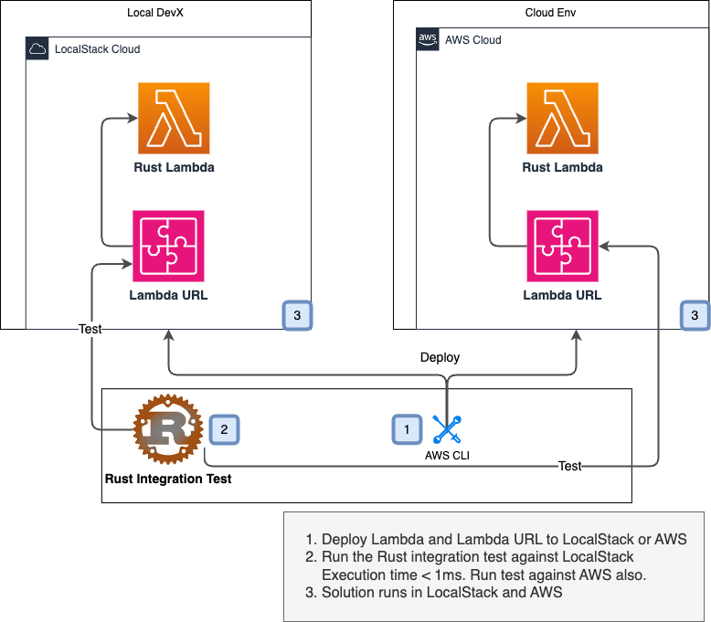

# Rust Rest AWS Lambda
See the AWS docs (here)[https://docs.aws.amazon.com/lambda/latest/dg/lambda-rust.html] for more information on creating a Rust Lambdas.


## Pre-requisites
1. Docker Desktop is running
2. LocalStack Pro auth token is set in the environment variable LOCALSTACK_AUTH_TOKEN

## Setup
Create a file name .env-gdc-local and add the following to it:
```bash
export LOCALSTACK_AUTH_TOKEN=<your LocalStack auth token>
```

Run a GDC in the root of the repo.
1. Clone this [GDC](https://github.com/devxpod/GDC)
2. Run the GDC
```bash
<path to GDC>/run-dev-container.sh
```

Connect to it and run the makefile target init-rust  
Building for lambda requires more libs be installed into the GDC to cross-compile the Rust binary.
Use the makefile target init-rust to install the necessary libs.

```bash
docker exec -it rls-dev-1 bash -l
make init-rust
```

## Build
```bash
make all
```

## Deploy to AWS
### Prerequisites
Set the AWS_ACCT variable in the makefile to the account number of the AWS account you want to deploy to.
AWS Account Number is defaulted to the LocalStack default account number.
Setup a profile in your ~/.aws/credentials file with the necessary permissions to create a lambda function.
To use a LocalStack profile, create it and set AWS_PROFILE like this [LocalStack AWS Profile](https://docs.localstack.cloud/user-guide/integrations/aws-cli/#configuring-a-custom-profile)

### Set AWS_PROFILE
```bash
export AWS_PROFILE=localstack
```

### Create Lambda Role
```bash
make create-lambda-role
```

### Deploy
Assume a role with the necessary permissions to create a lambda function.
```bash
make create-lambda-function
```

### Run integration tests
In the Ubuntu dev container, you probably have to run this twice. There is some issue with Rust compilation
on the Ubuntu dev container here. It doesn't happen on Mac and Windows. 
```bash
make test
```
